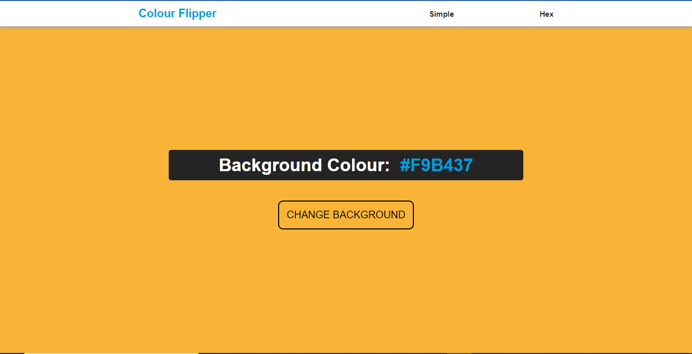
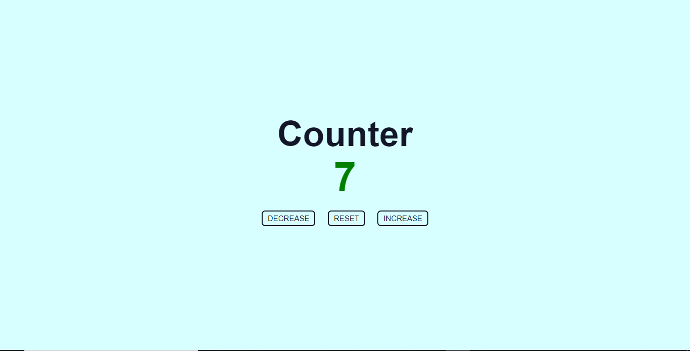
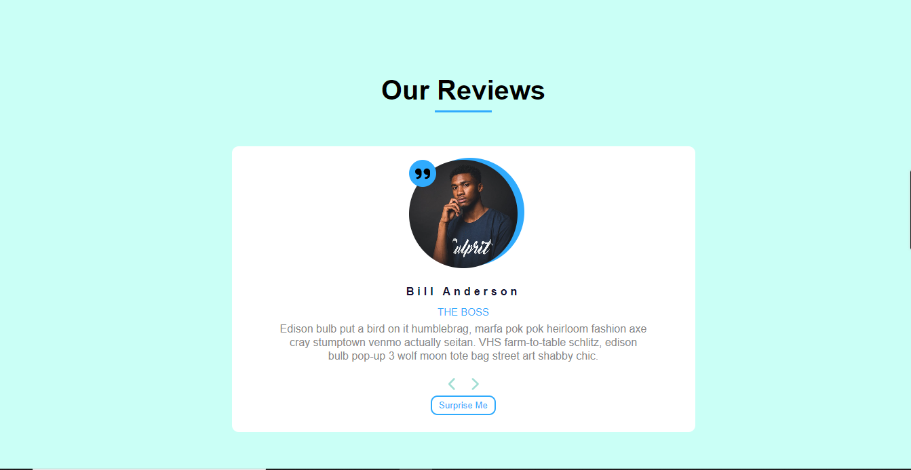

# JavaScript Tutorial - with _John Smilga_

This projects is a list of projects done during my tutorial on JavaScript with _John Smilga_ on the [**Udemy Website**](https://udemy.com). This projects ideas are from John Smilga but each of the projects I complete on my own before checking John's solution.

## Table of Contents

1. [Colour Flipper](#colour-flipper)
   - [How is this project created](#how-is-this-project-created)
   - [The JavaScript](#the-javascript)
   - [The Challenges](#the-challenges)
1. [Counter](#counter)
   - [How is this project created](#how-is-this-project-created-1)
   - [The JavaScript](#the-javascript-1)
   - [The Challenges](#the-challenges-1)
1. [Reviews](#reviews)
   - [How is this project created](#how-is-this-project-created-2)
   - [The javaScript](#the-javascript-2)
   - [The Challenges](#the-challenges-2)

## Colour Flipper

This project is on colours. The idea is that when a button is clicked, the background colour of the page changes randomly. Below is a screenshoot of what the page looks like:



### How is this project created?

This project makes use of HTML, CSS and JavaScript. There are 2 pages. One page to generate simple colours like 'red','black','yellow', etc. This is the [index.html](./01-colour-flipper/index.html). The order page is for the hex-code colour generator - the [hex.html](./01-colour-flipper/hex.html) page.

The index.html and the hex.html pages are basicly the same thing with the same html elements and they both make use of the same CSS and JavaScript file.

The html is simple with just a `<header>` with a `<nav>` in it, and a `<main>` tag that hold the button and the simple (or hex) colour codes.

```html
<!-- Main content code -->
<main class="container">
  <section class="colour-code">Background Colour: <span>#000000</span></section>
  <button class="btn">Change Background</button>
</main>
```

### The JavaScript

The basic of taking this tutorial course is to be grounded in my knowledge on javascript. As such, the main work for this project is done mainly by JavaScript.

For the simple colour generation, an array of simple colours is created and each colour is randomly seleted using the JavaScript `Math.random()` function and, of course, with some little manipulations.

```js
const simpleColours = ["red", "blue", "green", "black",...];
```

For the hex colour generator, three random numbers between 0 and 255 are (inclusive), each for the red, green and blue (rgb) component of the colour.

```js
let r = Math.floor(Math.random() * 255);
let g = Math.floor(Math.random() * 255);
let b = Math.floor(Math.random() * 255);
```

Each of this colour is then converted into its respective hexadecimal value and then concatenated together with an `#` to give the hex colour code. This colour code is displayed in a `<span>` tag and also applied as the background colour of the `<body>`

```js
colourCode.textContent = `#${r}${g}${b}`;
document.body.style.backgroundColor = `#${r}${g}${b}`;
```

### The Challenges

The major challenge I faced here is being able to convert the rgb numbers into their respective hexadecimal value. However, I was able to manually do this with a `while loop`, and the quotient(`/`) and modulus(`%`) operators.

## Counter

This projects creates a counter that increases or decreases when a button is clicked and also resets to zero whenever the reset is clicked:



### How is this Project Created

This project is much more simpler compared to the colour flipper. It also makes use of HTML, CSS and JavaScript and comprises only of one page.

The HTML is just a `<main>` tag with three `<button>` tags to handle the increament, decreament and the reset, and also a `<div>` where the result is displayed.

### The JavaScript

By default the counter starts at zero. This value is picked from the HTML with javaScript and set into a counter variable

```js
let counter = counterResult.textContent;
```

This is then incremented

```js
counter++;
counterResult.textContent = counter;
```

or decremented

```js
counter--;
counterResult.textContent = counter;
```

or reset

```js
counterResult.textContent = 0;
```

depending on the button clicked. Also, if the counter is below zero, it has a red colour, at zero is a black colour and above zero, a green colour is seen

### The Challenges

No challenge faced here

## Reviews

This project is about creating a review page with buttons to view next or previous reviews and also tro generate random reviews



### How is this Project Created

This project is a single page website. It makes use of HTML, CSS and JavaScript. The HTML is simple with just a `<h1>` heading. It also contains `<article>` and `<div>` tags that holds the [fontawesome icons](https://fontawesome.com/icons/) (`<i>` tags) and `<button>` tags that are responsible for changing the reviews sequentially and randomly.

### The JavaScript

The bulk of the work is done with the Javascript. Essentially, all the reviews elements were added dynamically with JavaScript which is divided into 3 files. One handles all the data neded for the review.

```js
// persons.js
const persons = [
  {
    name: "bill anderson",
    position: "the boss",
    image: "./images/bill-anderson.jpg",
    description:
      "Edison bulb put a bird on it humblebrag, marfa pok pok heirloom fashion axe cray stumptown venmo actually seitan. VHS farm-to-table schlitz, edison bulb pop-up 3 wolf moon tote bag street art shabby chic.",
  }, ...
];
```

Then another JavaScript file creates the dynamic HTML elements that hold all the reviews information or data which is then appended to (using ` element.appendChild(child)`) an existing `<section>` tag on the HTML page.

The third script handles the click events that changes the reviews sequentially and randomly. This is done by using the CSS `transform: transitionX` property to change the displayed reviews.

```js
let pos = 0;

nextBtn.onclick = () => {
  if (pos < 75) {
    pos += 25;
  } else {
    pos = 0;
  }
  reviews.style.transform = `translateX(-${pos}%)`;
  console.log(pos);
};
```

### The Challenges

The little challenge I have hear is changing the review when a button is clicked and starting all over when it reaches the last review. I was able to implement this by using a pos variable which is initially set to zero (`let pos = 0`). Then whenever the next button is clicked it changes pos to multiples of 25 upto 75 which the translates the reviews in the x direction. When `pos = 75`, I then set `pos = 0` so that it can start allover.
